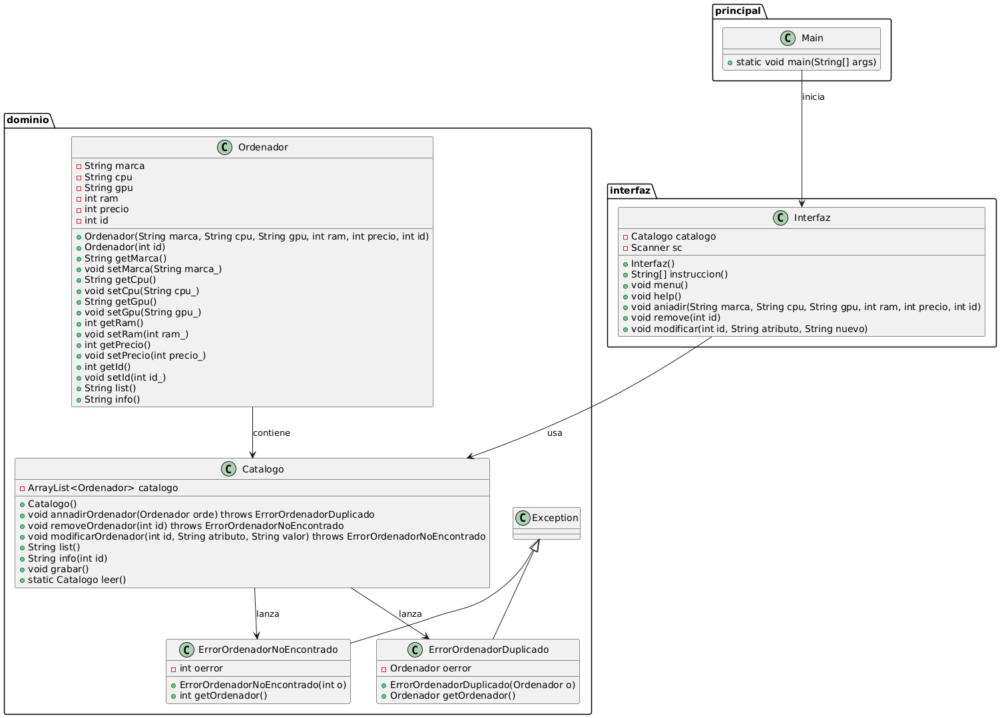

# Catálogo de Ordenadores

Este proyecto es una aplicación de consola en Java para gestionar un catálogo de ordenadores. Permite añadir, eliminar, modificar y listar ordenadores, así como guardar y cargar el catálogo desde un archivo.

## Estructura del Proyecto

El proyecto está dividido en varios paquetes:

- `dominio`: Contiene las clases principales del modelo, como `Ordenador`, `Catalogo`, y las excepciones `ErrorOrdenadorNoEncontrado` y `ErrorOrdenadorDuplicado`.
- `interfaz`: Contiene la clase `Interfaz` que maneja la interacción con el usuario a través de la consola.
- `principal`: Contiene la clase `Main` que inicia la aplicación.

## Clases Principales

### Ordenador

Representa un ordenador con atributos como marca, CPU, GPU, RAM, precio e ID. Implementa la interfaz `Serializable` para permitir su almacenamiento en archivos.

### Catalogo

Gestiona una lista de objetos `Ordenador`. Permite añadir, eliminar, modificar y listar ordenadores, así como guardar y cargar el catálogo desde un archivo.

### Interfaz

Maneja la interacción con el usuario a través de la consola. Proporciona un menú con opciones para listar, añadir, eliminar y modificar ordenadores.

### Main

Inicia la aplicación y muestra el menú de la interfaz.

## Excepciones

### ErrorOrdenadorNoEncontrado

Excepción lanzada cuando se intenta acceder a un ordenador que no existe en el catálogo.

### ErrorOrdenadorDuplicado

Excepción lanzada cuando se intenta añadir un ordenador con un ID que ya existe en el catálogo.

## Instrucciones de Uso

1. **Compilar el proyecto**: Asegúrate de tener el JDK instalado y compila el proyecto con el siguiente comando:
    ```sh
    javac -d bin src/dominio/*.java src/interfaz/*.java src/principal/*.java
    ```

2. **Ejecutar la aplicación**: Ejecuta la aplicación desde la carpeta `bin`:
    ```sh
    java principal.Main
    ```

3. **Comandos disponibles**:
   - `help`: Muestra el mensaje de ayuda.
   - `list`: Muestra información reducida de todos los ordenadores.
   - `info,Id`: Muestra información detallada de un ordenador específico.
   - `add,Marca,CPU,GPU,RAM,Precio,Id`: Añade un nuevo ordenador al catálogo.
   - `remove,Id`: Elimina un ordenador del catálogo.
   - `modify,Id,Atributo,NuevoValor`: Modifica un atributo de un ordenador existente.
   - `exit`: Guarda el catálogo y sale de la aplicación.

## Notas

- Asegúrate de que el archivo `catalogo.ser` esté en el mismo directorio que la aplicación al cargar el catálogo.
- Los atributos válidos para el comando `modify` son: `marca`, `cpu`, `gpu`, `ram`, `precio`.

## Diagrama UML

- 

## Autor

- **Luis Holgado Arranz**